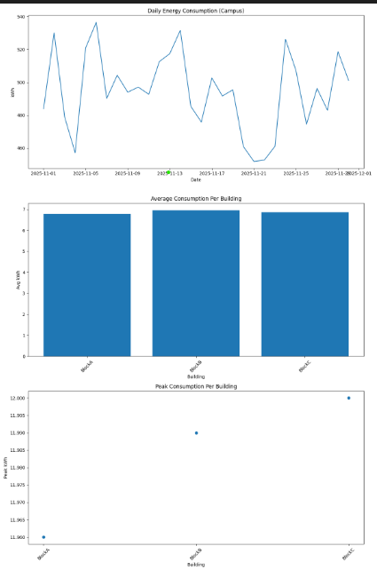

# Campus Electricity Consumption Dashboard  
A Python-based data analysis project that processes electricity usage from multiple campus buildings, generates daily and weekly consumption reports, produces visual dashboards, and implements an OOP model for building-wise energy management.




## 📂 Project Structure

```
campus-energy-dashboard/
│
├── data/                         
│     ├── BlockA_Nov2025.csv
│     ├── BlockB_Nov2025.csv
│     └── BlockC_Nov2025.csv
│
├── output/                       
│     ├── cleaned_energy_data.csv
│     ├── building_summary.csv
│     ├── summary.txt
│     └── dashboard.png
│
├── main.py                       
├── analysis.py                   
├── models.py                     
├── visualize.py                  
├── requirements.txt              
└── README.md                     
```

## 🚀 How to Run the Project

### 1️⃣ Install required libraries
```
pip install -r requirements.txt
```

### 2️⃣ Add CSV files  
Place all your building electricity CSVs inside the **data/** folder.

Each CSV should contain:

```
timestamp, kwh, building
```

If `building` is not present, it is added automatically from the filename.

### 3️⃣ Run the main script
```
python main.py
```

### 4️⃣ Outputs will be created inside `/output/`:
- cleaned_energy_data.csv  
- building_summary.csv  
- summary.txt  
- dashboard.png  

## 📊 Features

- Multi-building CSV ingestion  
- Daily & weekly energy aggregation  
- Building-wise summary  
- OOP-based modeling system  
- Visual dashboard (line + bar + scatter charts)  
- Summary report with insights  

## 📌 Notes
- Timestamp is kept as DatetimeIndex for resampling.  
- Timestamp is restored as a column for OOP & summary.  

## 👨‍💻 Author
Developed as part of a Python Capstone Assignment.
